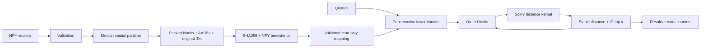
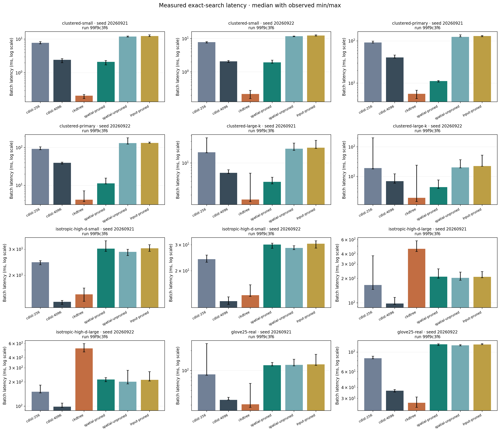

# Block-Pruned Vector Search

Previously `boundscout`. Package and command names remain unchanged (`boundscout`).

**Inspectable exact CPU vector search with spatial block pruning.**

[简体中文](README_zh.md) · [](pyproject.toml) [](LICENSE) [](https://github.com/hardwork-xu/block-pruned-vector-search/actions/workflows/ci.yml)

I want to maintain a retrieval project whose speed and limits can be explained: which block was skipped, how many distances were evaluated, and when index construction pays for itself. BoundScout is for developers and students studying offline feature-vector retrieval.

The contribution is an integrated implementation of spatial packing, conservative floating-point bounds, deterministic tie handling, read-only persistence, and reproducible evidence. Bounding boxes and median partitioning are established methods. NumPy/SciPy supply arrays and compiled distance kernels; this repository implements packing, traversal, candidate maintenance, validation and control. See [RESEARCH](docs/en/RESEARCH.md) and [NOTICE](NOTICE.md) for prior work and attribution.

## Features and architecture

- Float64 squared-Euclidean top-k with `(distance, original row ID)` ordering, optional pruning and spatial/input layouts.
- Immutable index, NPY persistence and read-only mappings; loading validates schema, hashes, the complete ID permutation and block geometry.
- Programmatic API and bilingual `demo`, `build`, `query` commands; the default path needs no network, model or key.
- Python 3.12. Local verification: macOS arm64 / M1 Pro CPU. Linux/macOS CI status follows actual run receipts; Docker build and demo passed in Ubuntu CI; it was not run locally.



For a block B with coordinate bounds [l,u], the real-arithmetic lower bound for q is:

$$L_B(q)=\sum_j \max(l_j-q_j,0,q_j-u_j)^2.$$

Visit blocks in ascending bound order, maintain top-k, and stop only when the conservative lower bound strictly exceeds the current kth distance. Research documentation explains floating-point safeguards and supported inputs. “Exact” means retrieval consistent with float64 exhaustive search in that range, not a formal arbitrary-real-arithmetic guarantee.

## Installation and Quick Start

From the project directory, with Python 3.12:

```bash
python3 -m venv .venv
make install
make demo
.venv/bin/python examples/local_vectors.py
make test lint typecheck docs build
```

```python
import numpy as np
from boundscout import BoundIndex

vectors = np.random.default_rng(7).normal(size=(2048, 16))
with BoundIndex.build(vectors, leaf_size=128) as index:
    result = index.search(vectors[:3], k=5)
    print(result.indices, result.distances)
```

This self-query example demonstrates the API; formal experiments use independent queries. The [walkthrough](docs/en/WALKTHROUGH.md) covers real file workflows. Inputs are real-valued 2D NPY arrays and outputs contain **squared** Euclidean distances. Default logical index-array and result budgets are 1 GiB and 64 MiB; neither is a hard process-RSS limit.

## Benchmark Results: targets and measurements

Apple M1 Pro, 16 GiB, macOS arm64, Python 3.12.2, NumPy 2.2.6, SciPy 1.15.3, one native thread. Shared interactive host with other CPU activity; no affinity or thermal control. Each method has one warmup and seven randomized-order repetitions on each of two independent seeds. Values below are medians of 64-query batches. All 72 combinations and 504 timings are preserved, rather than selected best samples.

Primary workload: N=32768, d=32, k=10. The frozen target uses the cdist256 baseline:

| Seed | Target speedup | Measured speedup | Target fewer vectors | Measured fewer vectors |
|---|---:|---:|---:|---:|
| 20260921 | 1.50× | 8.18× | 75% | 92.72% |
| 20260922 | 1.50× | 8.18× | 75% | 92.74% |

The stronger large-block cdist4096 and mature cKDTree comparators are also shown:

| Workload / seed | cdist256 ms | cdist4096 ms | cKDTree ms | BoundScout ms | × vs4096 | Fewer vectors |
|---|---:|---:|---:|---:|---:|---:|
| clustered-primary / 20260921 | 91.535 | 40.504 | 5.570 | 11.195 | 3.62 | 92.72% |
| clustered-primary / 20260922 | 92.389 | 39.464 | 4.160 | 11.288 | 3.50 | 92.74% |
| isotropic-high-d-large / 20260921 | 165.678 | 97.975 | 463.059 | 210.032 | 0.47 | 0.00% |
| isotropic-high-d-large / 20260922 | 151.482 | 98.486 | 520.249 | 214.641 | 0.46 | 0.00% |
| glove25-real / 20260921 | 87.264 | 36.001 | 30.725 | 120.734 | 0.30 | 2.28% |
| glove25-real / 20260922 | 85.087 | 36.710 | 26.826 | 122.022 | 0.30 | 1.23% |

**Scope of the conclusion:** clustered workloads beat large-block exhaustive search, but cKDTree is still faster on those clustered workloads. The 128-dimensional isotropic workload prunes nothing. Real GloVe25 vectors permit little pruning and become slower. Synthetic gains do not establish a general embedding-search speedup.



Construction, first query, save, fully validated load, logical array bytes, isolated-process peak RSS and amortization are recorded separately. Steady-state timing excludes preparation costs. Seven repetitions do not justify p99 or statistical-significance claims. See [EXPERIMENTS](docs/en/EXPERIMENTS.md) and generated [RESULTS](docs/en/RESULTS.md) for complete ablations and fairness differences.

Raw evidence: [full.json](results/raw/full.json); source revision `6b73052`, run ID `99f9c3f6-cfb9-4e8b-a393-2d38033b24b5`. Per-file SHA256 identifies the measured source while uncommitted documents existed. Reproduce into a new filename to retain previous evidence:

```bash
.venv/bin/python scripts/download_data.py --expected-sha256 51004cb0ae962159f0db507a51fec2b395de14b166f55976c89f16bd2f8b6391
.venv/bin/python benchmark.py --config configs/full.json --output results/raw/reproduction.json --measure-rss
.venv/bin/python scripts/analyze.py --input results/raw/reproduction.json --output-dir work/reproduction/results --docs-root work/reproduction/docs
```

`make benchmark` runs a small offline check. `.venv/bin/python scripts/render_readme.py` regenerates homepage tables from archived `full.json`; reproduction does not overwrite the original headline numbers.

## Limits and maintenance

High-dimensional or overlapping boxes can eliminate pruning benefits; Python traversal and candidate maintenance add overhead. Building needs resident data and temporary copies. The immutable index accepts trusted local numeric input; hashes do not authenticate its origin. There is no GPU, approximate mode, online update, HTTP service or production deployment claim. Read [SECURITY](SECURITY.md).

[Research](docs/en/RESEARCH.md) · [Architecture](docs/en/ARCHITECTURE.md) · [Experiments](docs/en/EXPERIMENTS.md) · [Development](docs/en/DEVELOPMENT.md) · [Walkthrough](docs/en/WALKTHROUGH.md) · [Release](docs/en/RELEASE.md) · [Résumé/evidence](docs/en/RESUME.md) · [Project talk](docs/en/PROJECT_TALK.md) · [Contributing](CONTRIBUTING.md)

[acceptance.json](results/acceptance.json) separates passed, failed and not-run checks. License: [MIT](LICENSE); third-party attribution: [NOTICE](NOTICE.md). Use [CITATION.cff](CITATION.cff), retaining the version, source revision and run ID; no DOI or published-paper claim is made.
