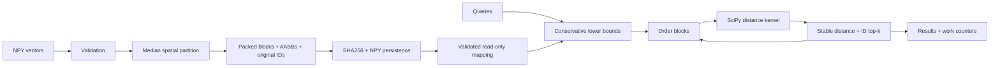

# BoundScout

**使用可审阅块剪枝的 CPU 精确向量检索。**

[English](README.md) · [](pyproject.toml) [](LICENSE) [](https://github.com/hardwork-xu/boundscout/actions/workflows/ci.yml)

我希望维护一个能解释性能来源和边界的检索项目：不仅输出最近邻，还能检查为何跳过某个块、计算了多少距离，以及建索引成本何时能被摊销。BoundScout 面向研究离线特征向量检索的开发者与学生。

项目贡献是空间分块、保守浮点下界、确定性等距排序、只读持久化及可复现实验的一体实现。包围盒剪枝与中位数划分是已有方法；NumPy/SciPy 提供数组和编译距离核，本仓库实现分块、遍历、候选维护、校验和控制层。相关方法与归属见 [RESEARCH](docs/zh/RESEARCH.md) 和 [NOTICE](NOTICE_zh.md)。

## 实际能力与架构

- float64 平方欧氏 top-k；按距离、原始行 ID 排序，剪枝可关闭，空间/输入布局可对照。
- 不可变索引、NPY 持久化、只读内存映射；加载验证格式、哈希、完整 ID 排列与包围盒。
- 程序化 API 与双语 `demo`、`build`、`query` 命令；默认无需网络、模型或密钥。
- Python 3.12；本地验证为 macOS arm64 / M1 Pro CPU。Linux/macOS CI 状态以实际运行记录为准；Docker 已在 Ubuntu CI 验证，本地未执行。



对块 B，坐标包围盒为 [l,u]，查询 q 的实数下界为：

$$L_B(q)=\sum_j \max(l_j-q_j,0,q_j-u_j)^2.$$

按下界从小到大访问块，保留 top-k；只有保守下界严格大于当前第 k 个距离时才停止。浮点保护与适用范围见研究文档；“精确”指支持范围内与 float64 穷举一致的检索，不宣称对任意实数进行形式化精确计算。

## 安装与 Quick Start

在项目目录中使用 Python 3.12：

```bash
python3 -m venv .venv
make install
make demo
.venv/bin/python examples/local_vectors.py
make test lint typecheck docs build
```

```python
import numpy as np
from boundscout import BoundIndex

vectors = np.random.default_rng(7).normal(size=(2048, 16))
with BoundIndex.build(vectors, leaf_size=128) as index:
    result = index.search(vectors[:3], k=5)
    print(result.indices, result.distances)
```

上面的自查询示例用于演示；正式实验使用独立查询。真实文件流程见[代码导读](docs/zh/WALKTHROUGH.md)。数据格式为实数二维 NPY，距离输出为**平方**欧氏距离；索引默认逻辑数组预算 1 GiB，结果预算 64 MiB，二者都不是进程 RSS 硬上限。

## Benchmark Results：目标与实测

Apple M1 Pro、16 GiB、macOS arm64、Python 3.12.2、NumPy 2.2.6、SciPy 1.15.3、单原生线程；共享交互式主机，有其他 CPU 活动，无绑核或温控。每方法预热一次、7 次随机轮换计时，两个独立数据种子；表内为 64 查询批次中位数。全部 72 个组合和 504 次计时保存在原始文件中，未挑选最佳样本。

主要负载 N=32768、d=32、k=10。实验前冻结目标使用 cdist256 基线：

| 种子 | Target 加速 | Measured 加速 | Target 少算 | Measured 少算 |
|---|---:|---:|---:|---:|
| 20260921 | 1.50× | 8.18× | 75% | 92.72% |
| 20260922 | 1.50× | 8.18× | 75% | 92.74% |

同时报告更强的大块 cdist4096 与成熟 cKDTree，避免仅展示有利基线：

| 负载 / 种子 | cdist256 ms | cdist4096 ms | cKDTree ms | BoundScout ms | 相对4096倍数 | 少算向量 |
|---|---:|---:|---:|---:|---:|---:|
| clustered-primary / 20260921 | 91.535 | 40.504 | 5.570 | 11.195 | 3.62 | 92.72% |
| clustered-primary / 20260922 | 92.389 | 39.464 | 4.160 | 11.288 | 3.50 | 92.74% |
| isotropic-high-d-large / 20260921 | 165.678 | 97.975 | 463.059 | 210.032 | 0.47 | 0.00% |
| isotropic-high-d-large / 20260922 | 151.482 | 98.486 | 520.249 | 214.641 | 0.46 | 0.00% |
| glove25-real / 20260921 | 87.264 | 36.001 | 30.725 | 120.734 | 0.30 | 2.28% |
| glove25-real / 20260922 | 85.087 | 36.710 | 26.826 | 122.022 | 0.30 | 1.23% |

**结论范围：**聚类负载相比大块穷举更快，但 cKDTree 在这些聚类负载上仍更快；128 维随机负载未能剪枝；真实 GloVe25 词向量上的剪枝很少，耗时反而增加。不能把合成数据收益外推为通用嵌入检索加速。


建索引、首次查询、保存、完整验证加载、逻辑数组字节、独立进程峰值 RSS 和摊销点分别记录。稳态计时不包含这些准备成本；七次样本不支持 p99 或统计显著性声明。完整消融、范围与公平性差异见 [EXPERIMENTS](docs/zh/EXPERIMENTS.md) 和自动生成的 [RESULTS](docs/zh/RESULTS.md)。

原始证据：[full.json](results/raw/full.json)；源码提交 `6b73052`，run ID `99f9c3f6-cfb9-4e8b-a393-2d38033b24b5`。文件级 SHA256 记录未提交文档存在时的实际被测源码。复现时使用新文件名保留旧结果：

```bash
.venv/bin/python scripts/download_data.py --expected-sha256 51004cb0ae962159f0db507a51fec2b395de14b166f55976c89f16bd2f8b6391
.venv/bin/python benchmark.py --config configs/full.json --output results/raw/reproduction.json --measure-rss
.venv/bin/python scripts/analyze.py --input results/raw/reproduction.json --output-dir work/reproduction/results --docs-root work/reproduction/docs
```

`make benchmark` 运行离线小规模检查。主页表格由 `.venv/bin/python scripts/render_readme.py` 从归档 `full.json` 生成，复现实验不会覆盖原始数字。

## 局限与维护资料

高维/重叠包围盒会使剪枝失效；Python 遍历和候选维护有开销；构建需要数据及临时副本留在内存。索引不可变，只支持可信本地数值输入；校验和不能证明文件来源可信。没有 GPU、近似检索、在线更新、HTTP 服务或生产部署声明。详见[安全与限制](SECURITY_zh.md)。

[研究](docs/zh/RESEARCH.md) · [架构](docs/zh/ARCHITECTURE.md) · [实验](docs/zh/EXPERIMENTS.md) · [开发记录](docs/zh/DEVELOPMENT.md) · [代码导读](docs/zh/WALKTHROUGH.md) · [发布材料](docs/zh/RELEASE.md) · [简历与证据](docs/zh/RESUME.md) · [项目讲解](docs/zh/PROJECT_TALK.md) · [贡献](CONTRIBUTING_zh.md)

验收记录见 [acceptance.json](results/acceptance.json)；其通过、失败和未执行状态分别记录。MIT 许可证见 [LICENSE](LICENSE)，第三方归属见 [NOTICE](NOTICE_zh.md)。引用使用 [CITATION.cff](CITATION.cff)，并保留版本、源码提交及运行 ID；无 DOI 或已发表论文声明。
