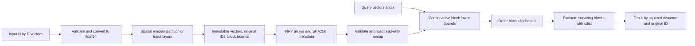

# Architecture and numerical contract

[简体中文](../zh/ARCHITECTURE.md) · [Research](RESEARCH.md) · [Walkthrough](WALKTHROUGH.md)

## Data flow

[`engine.py`](../../src/boundscout/engine.py) owns validation, partitioning, bounds, candidate selection and exhaustive search. [`storage.py`](../../src/boundscout/storage.py) owns index persistence and mmap lifecycle. [`cli.py`](../../src/boundscout/cli.py) connects these operations to files. The benchmark consumes the same engine rather than maintaining a separate optimized implementation.

## Building blocks

`BoundIndex.build(data, leaf_size=256, layout="spatial", max_bytes=...)` accepts a nonempty two-dimensional numeric matrix. Each input row has a stable original ID. Spatial construction recursively chooses the coordinate with widest range and splits at its median until a leaf fits the configured size. The stored point order changes; returned IDs still refer to original input rows. The `input` layout retains consecutive input blocks for the packing ablation.

Each leaf stores a contiguous vector range and its coordinate-wise minimum and maximum. Boxes describe actual leaf contents. The index is immutable after construction: modifying indexed coordinates would invalidate bounds and could cause incorrect pruning. Build a replacement index to change the collection.

For N points, D coordinates, B leaf blocks and maximum leaf size L, the recursive widest-range median construction has an O(ND log N) upper bound. The index arrays require O(ND + N + BD) storage; the coordinates dominate most workloads. Construction can require additional copies and temporary arrays. The default 1 GiB index budget is a validation limit, not a claim that process peak RSS stays below 1 GiB.

## Querying

The search computes a lower bound for every box and orders blocks by that bound. It evaluates points in surviving blocks with squared Euclidean distance and updates the best k candidates. Pruning starts only when k candidates exist. A strict bound comparison preserves the possibility of a better original ID at an equal distance. Disabling pruning leaves the spatial layout in place and also bypasses bound calculation and sorting; its timing difference includes both the saved distance work and the cost of those stages.

For V evaluated vectors, the per-query cost is

$$
O(BD + B\log B + VD + S),
$$

where S is the cumulative cost of candidate selection and deterministic tie handling. It must not be omitted from latency interpretation. In an adverse case V=N and bound/order overhead remains. Smaller leaves may tighten bounds while increasing B and candidate-maintenance calls; larger leaves do the reverse.

`exhaustive_search` evaluates the same squared-distance task in blocks, with a default block size of 256. It bounds the distance working set instead of allocating a complete query-by-corpus matrix. Query results nevertheless require O(Qk) space for Q queries. The default output limit is 64 MiB; it is separate from index storage and from total process memory.

## Numerical contract

- Computation uses float64 squared Euclidean distance. Inputs must be finite, with at most 4,096 dimensions and absolute coordinate magnitude at most `1e100`. The limits keep the supported squared-distance scale far below float64 overflow.
- The API's exact-search contract is exhaustive float64 top-k semantics with `(squared distance, original row ID)` tie ordering. The [protocol](PROTOCOL.md) validates identical ordered IDs and distance agreement at `rtol=1e-12, atol=1e-12` on the tested cases.
- Bounds receive a conservative floating-point allowance before pruning. This safeguard is not a formally verified interval-arithmetic implementation or a proof that all arbitrarily close distances are ranked as exact real numbers.
- Distances are computed from coordinate differences. The expanded dot-product identity can suffer cancellation and is not the distance kernel used here. Representability of the inputs does not make every subsequent subtraction, multiplication or reduction exact.
- Equal computed distances use the original ID tie rule. Nearby unequal values are not merged using a tolerance; tolerances belong to validation, not the ranking key.

Specifically, the current guard multiplies the computed bound by `1 - 64 * eps * (D + 1)`, moves it one representable step downward and clamps it to zero. Here `eps` is `np.finfo(np.float64).eps`. The stopping threshold is moved one representable step upward. These implementation details are exposed for audit, not presented as a universal error proof.

Changing the distance kernel, dtype, reduction order or pruning allowance can change numerical behavior. Such changes require adversarial correctness checks and rerunning affected experiments. Read the [real-arithmetic argument](RESEARCH.md#why-pruning-is-valid-in-real-arithmetic) separately from this implementation contract.

## Persistence and trust boundary

An index directory contains `points.npy`, `ids.npy`, `offsets.npy`, `lower.npy`, `upper.npy` and `metadata.json` with SHA256 fingerprints. With a single writer, saving flushes and fsyncs the arrays and metadata in a temporary sibling directory, then publishes the completed index at a new path through an atomic rename. It does not overwrite an existing index in place; atomic publication is not a complete power-loss durability guarantee.

The loader validates metadata, array structure, the complete ID permutation and block geometry before returning read-only memory maps. Default `verify=True` also checks every array hash. `verify=False` skips hashes only, not geometry and structural validation. Loading avoids a full resident vector copy, but verification still reads the arrays and reconstructs block extrema; the ID permutation check also requires temporary memory. mmap loading is neither constant-time nor zero-I/O.

Read-only mapping prevents writes through the loaded arrays; it does not prevent another process from replacing or modifying files. Keep an index directory immutable while in use, publish a new directory for updates, and close a loaded index when finished. Do not close an index concurrently with search, or access arrays after closing their mappings. Use `build` or `load` rather than the internal array constructor.

SHA256 detects changed content relative to the manifest. It is not an authenticity signature: an actor able to replace both arrays and metadata can create a different self-consistent index. This file format is intended for indexes created or reviewed by the operator, not as a hostile-input interchange protocol. There is no mutable transaction layer, network service, access-control system or concurrent writer protocol.

## What to measure

Logical array bytes, build-time temporary memory and isolated-process peak RSS answer different questions. Record build, save, verified load, first query and steady-state queries separately. Count evaluated vectors, but interpret that count alongside wall time and the exhaustive and cKDTree baselines. The [protocol](PROTOCOL.md) defines the measurement procedure; [Results](RESULTS.md) contains actual observations.
