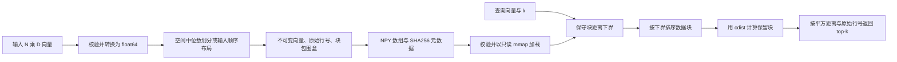

# 架构与数值契约

[English](../en/ARCHITECTURE.md) · [研究依据](RESEARCH.md) · [使用导览](WALKTHROUGH.md)

## 数据流

[`engine.py`](../../src/boundscout/engine.py) 负责校验、划分、下界、候选选择和穷举搜索；[`storage.py`](../../src/boundscout/storage.py) 负责持久化与 mmap 生命周期；[`cli.py`](../../src/boundscout/cli.py) 将这些操作连接到文件。基准测试调用同一个引擎，不另写一份专用于跑分的优化实现。

## 构建数据块

`BoundIndex.build(data, leaf_size=256, layout="spatial", max_bytes=...)` 接受非空二维数值矩阵。每个输入行都有稳定的原始 ID。空间构建递归选择极差最大的坐标，以中位数划分，直到叶块不超过配置大小。存储中的点顺序会变化，但返回 ID 始终对应原始输入行。`input` 布局保留输入中的连续块，用于空间聚集消融。

每个叶块保存连续的向量范围，以及各坐标的最小值和最大值。包围盒来自叶块的实际内容。索引构建后不可变：修改坐标会使包围盒失效，可能造成错误剪枝。更新数据集合时，应构建替代索引。

对 N 个点、D 个坐标、B 个叶块和最大叶块大小 L，递归的最大极差中位数构建具有 O(ND log N) 上界。索引数组的存储量为 O(ND + N + BD)，多数负载中坐标占主导。构建阶段还可能需要额外复制和临时数组。默认 1 GiB 索引预算是校验限制，不代表进程峰值 RSS 一定低于 1 GiB。

## 执行查询

搜索先计算每个包围盒的下界，再按下界排列数据块。对保留块中的点计算平方欧氏距离，并更新最优 k 个候选。只有已有 k 个候选后才开始剪枝。严格的下界比较保留了等距离时遇到更小原始行号的可能性。关闭剪枝会保留空间布局，同时跳过下界计算与排序；两者的耗时差既包含省下的距离计算，也包含这些阶段自身的成本。

设实际计算了 V 个向量，则每次查询的成本为

$$
O(BD + B\log B + VD + S),
$$

其中 S 是候选选择和确定性并列处理的累计成本，解释延迟时不能忽略。最不利时 V=N，但仍须支付下界与排序开销。小叶块可能让下界更紧，却增加 B 和候选维护次数；大叶块则相反。

`exhaustive_search` 以分块方式计算相同的平方距离任务，默认块大小为 256。它限制距离计算的工作集，不分配完整的“查询数乘语料数”矩阵。但 Q 个查询的结果仍需要 O(Qk) 空间。默认输出限制是 64 MiB，与索引存储和进程总内存分别计算。

## 数值契约

- 计算使用 float64 平方欧氏距离。输入必须有限，维度不超过 4,096，坐标绝对值不超过 `1e100`。这些限制让支持的平方距离尺度远离 float64 溢出。
- API 的精确搜索契约是 float64 穷举 top-k 语义，按 `(平方距离, 原始行号)` 处理并列。[实验协议](PROTOCOL.md) 对测试用例要求有序 ID 完全一致，距离满足 `rtol=1e-12, atol=1e-12`。
- 剪枝前会为下界加入保守浮点余量。这项保障不是经过形式化验证的区间算术，也不能证明所有任意接近的距离都按精确实数结果排序。
- 距离从坐标差计算；展开成点积的恒等式可能产生消去误差，不是本项目的距离内核。输入可以精确表示，不代表后续每次减法、乘法和归约也都精确。
- 计算结果完全等距时按原始 ID 排序。不会使用容差合并接近但不相等的值；容差只用于验证，不属于排序键。

具体而言，当前保障把计算下界乘以 `1 - 64 * eps * (D + 1)`，向下移动一个可表示数，再截断到不小于零。这里 `eps` 是 `np.finfo(np.float64).eps`。终止阈值则向上移动一个可表示数。公开这些细节是为了审计，不是将其当作通用误差证明。

更换距离内核、dtype、归约顺序或剪枝余量，可能改变数值行为。此类修改必须补充针对性正确性检查，并重新运行受影响实验。[实数运算的剪枝论证](RESEARCH.md#实数运算中剪枝为何成立) 与本实现契约应分别阅读。

## 持久化与信任边界

索引目录包含 `points.npy`、`ids.npy`、`offsets.npy`、`lower.npy`、`upper.npy` 和带 SHA256 指纹的 `metadata.json`。在单写入者条件下，保存先在同级临时目录写入数组与元数据，flush 并 fsync，再通过原子重命名把完整索引发布到新路径。不在原位置覆盖已有索引；原子发布也不代表完整的断电持久性保障。

加载器在返回只读内存映射前，会校验元数据、数组结构、完整 ID 排列和块几何。默认 `verify=True` 还检查每个数组哈希。`verify=False` 只跳过哈希，不跳过几何与结构校验。加载避免完整的驻留向量副本，但验证仍会读取数组并重新计算块极值；ID 排列检查也需要临时内存。mmap 加载既不是常数时间，也不是零 I/O。

只读映射阻止通过加载的数组写入，不会阻止其他进程替换或修改文件。使用期间应保持索引目录不变，更新时发布新目录，用完后关闭加载的索引。不要在搜索的同时关闭索引，也不要在关闭映射后继续访问相应数组。通过 `build` 或 `load` 创建索引，不直接调用内部数组构造器。

SHA256 检测相对清单发生的内容变化，不是身份认证签名：能够同时替换数组和元数据的人，仍可生成另一份自洽索引。该格式面向操作者自行构建或检查的索引，不是处理恶意输入的通用交换协议。项目不提供可变事务层、网络服务、访问控制系统或并发写入协议。

## 应测量哪些成本

逻辑数组字节数、构建临时内存和独立进程峰值 RSS 回答不同的问题。应分别记录构建、保存、校验加载、首次查询和稳态查询。记录实际计算向量数，但须结合耗时、穷举和 cKDTree 基线解释。[实验协议](PROTOCOL.md) 规定测量过程，[实验结果](RESULTS.md) 保存实际观察。
